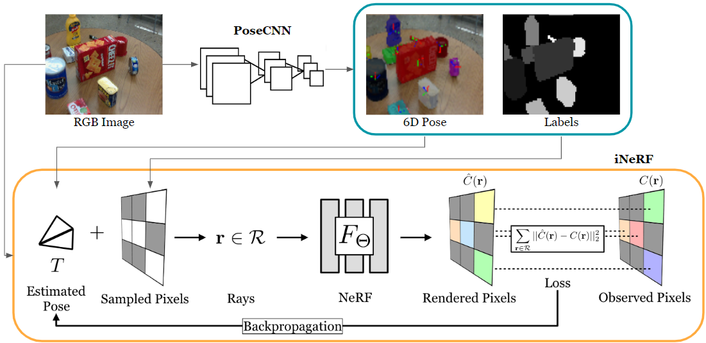
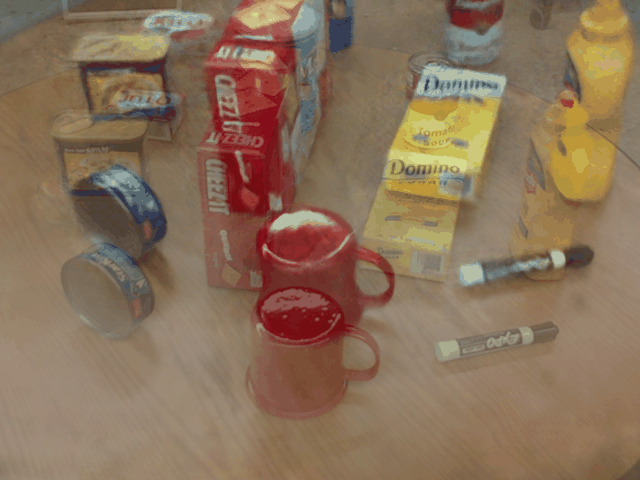
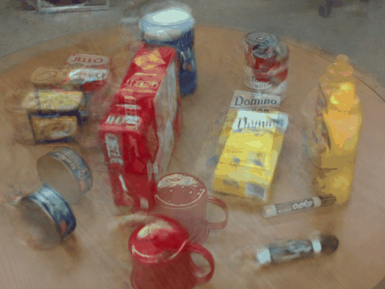
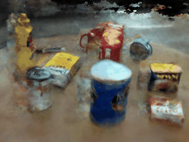

# Single-Image to Camera Pose with iNeRF and PoseCNN

We present an efficient and robust system for view synthesis and pose estimation by integrating PoseCNN and iNeRF. Our method leverages the pose and object segmentation predictions from PoseCNN to improve the initial camera pose estimation and accelerate the optimization process in iNeRF.



<p align="left">



</p>

> Left - **Interest Regions Sampling**; right - **Mask Region Sampling**. 
> Mask regions sampling strategy provides faster convergence and doesnt stick in a local minimum like interest regions. 


#### Scripts
- `python scripts/run_inerf.py --config configs/inerf/PROPS.txt` for optimizing iNeRF
- `python scripts/run_nerf.py --config configs/nerf/PROPS.txt` for training and rendering NeRF
- `python scripts/run_posecnn.py` for training and evaluating PoseCNN


## Installation

1. To start, install `pytorch` and `torchvision` according to your own GPU version, and then create the environment using conda:

    > If you see `ParseException: Expected '}', found '=' (at char 759), (line:34, col:18)` error, check [here](https://github.com/sxyu/pixel-nerf/issues/61)

    ```sh
    git clone https://github.com/silvery107/fast-iNeRF.git
    cd fast-iNeRF
    conda env create -f environment.yml
    conda activate inerf
    ```
2. Download pretrained NeRF and PoseCNN models on PROPS dataset [here](https://drive.google.com/drive/folders/1WdyWak9-75OHoA7rJ2Frxghq6LSe3q71?usp=share_link) and place them in `<checkpoints>` folder.

3. Download the [PROPS-NeRF Dataset](https://drive.google.com/file/d/1HiYTfOr-Jw8TeMhc-61tUcyF1dRMYYr5/view?usp=share_link) and extract it to `<data>` folder. If you want to train a new PoseCNN model, also download  the [PROPS-Pose-Dataset](https://drive.google.com/file/d/15rhwXhzHGKtBcxJAYMWJG7gN7BLLhyAq/view). The dataset structure should be like this

    ```
    data
    ├── nerf_synthetic
    │   ├── lego
    │   └── ...
    ├── PROPS-NeRF
    │   ├── obs_imgs
    │   └── ...
    └── PROPS-Pose-Dataset
        └── ...
    ```


## Quick Start

### Enhanced iNeRF
- To run the algorithm on PROPS NeRF
    ```
    python scripts/run_inerf.py --config configs/inerf/PROPS.txt --posecnn_pose_init --mask_region
    ```
    If you want to store gif video of optimization process, set `--overlay`. 
- Set `--posecnn_pose_init` will enable pose initialization using estimation from PoseCNN and set `--mask_region` will enable mask region sampling using segmentation mask from PoseCNN.

- All other parameters such as _batch size_, _sampling strategy_, _initial camera error_ you can adjust in corresponding config [files](https://github.com/silvery107/fast-iNeRF/tree/main/configs).
<!-- 
To run the algorithm on the llff dataset, just download the "nerf_llff_data" folder from [here](https://drive.google.com/drive/folders/128yBriW1IG_3NJ5Rp7APSTZsJqdJdfc1) and put the downloaded folder in the "data" folder. -->

- All NeRF models were trained using the PyTorch implementation of the original NeRF, see the next section.


### NeRF PyTorch


- To train a full-resolution PROPS NeRF:
    ```bash
    python scripts/run_nerf.py --config configs/nerf/PROPS.txt
    ```
    After training for 100k iterations (~6 hours on a single RTX 3060 GPU), you can find the following video at `<logs>` folder. Set `--render_only` for evaluation render only.

     


- Continue training from checkpoints

    You can directly resume any training using the command above.

### PoseCNN
- To train a new PoseCNN model on PROPS Pose Dataset

    ```bash
    python scripts/run_posecnn.py --train
    ```
    Set `--eval` for evaluation only and run the 5°5cm metric on validation set. 


## Dependencies

- PyTorch >= 1.11
- torchvision >= 0.12

## Acknowlegment
Thanks for their great open-source software
- **NeRF** - *PyTorch implementation from* [yenchenlin/nerf-supervision-public](https://github.com/yenchenlin/nerf-supervision-public)
- **iNeRF** - *Pytorch implementation from* [salykovaa/inerf](https://github.com/salykovaa/inerf)
- **PoseCNN** - *PyTorch implementation from* [DeepRob course project](https://deeprob.org/projects/project4/)
